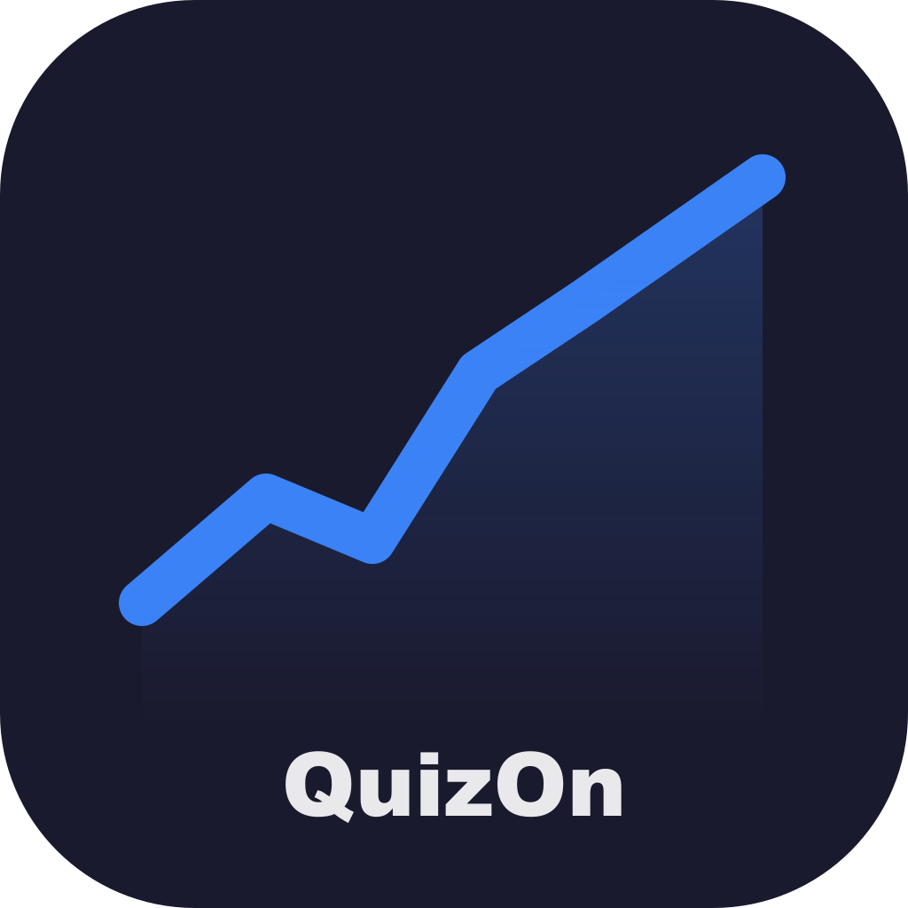

# 📈 QuizOn — 매일 10문제로 끝내는 주식공부

<p align="center">
  
</p>

<p align="center">
  <b>주식 공부, 매일 10분이면 충분해요.</b><br/>
  OX · 객관식 퀴즈로 핵심 개념만 빠르게!
</p>

<p align="center">
  
  
  
  
</p>

---

## 📱 스크린샷

| 홈 화면 | 퀴즈 화면 | 결과 화면 |
|:---:|:---:|:---:|
| 오늘 날짜 + 퀴즈 정보 | OX / 객관식 문제 | 점수 + 오답 복습 |

---

## ✨ 주요 기능

- **매일 10문제** — 날짜 기반으로 50개 문제 중 랜덤 출제
- **OX · 객관식** — 두 가지 유형으로 지루하지 않게
- **즉각 해설** — 정답 선택 후 바로 해설 확인
- **오답 복습** — 결과 화면에서 틀린 문제 한눈에 정리
- **🔥 연속 출석** — 며칠 연속으로 공부했는지 스트릭 표시
- **로컬 저장** — 오늘 점수 · 히스토리 · 스트릭 자동 저장

---

## 🗂 문제 카테고리

| 카테고리 | 내용 |
|---|---|
| 📘 기초 개념 | 주식 시장 구조, 거래 방식, 상한가·하한가 등 |
| 📊 주요 지표 | PER · PBR · ROE · EPS · ROA 등 밸류에이션 지표 |
| 💬 투자 용어 | 공매도, IPO, 배당락, 골든크로스, 테마주 등 |

---

## 🏗 기술 스택

```
React Native (Expo SDK 56)
├── @react-navigation/stack     # 화면 전환
├── @react-native-async-storage # 로컬 데이터 저장
└── expo-status-bar             # 상태바 관리
```

---

## 🚀 로컬 실행

```bash
# 1. 클론
git clone https://github.com/kimmingeun/quizon.git
cd quizon

# 2. 패키지 설치
npm install

# 3. 실행
npx expo start

# 📱 Expo Go 앱으로 QR 스캔하면 바로 확인 가능!
```

VSCode에서 바로 확인하려면 웹 브라우저로 실행할 수 있어요.

```bash
npx expo start --web
```

> 브라우저에서 `http://localhost:8081`로 열립니다.

---

## 📁 프로젝트 구조

```
quizon/
├── src/
│   ├── screens/
│   │   ├── HomeScreen.js       # 홈 (오늘 퀴즈 정보 + 시작 버튼)
│   │   ├── QuizScreen.js       # 퀴즈 (OX / 객관식 + 해설)
│   │   └── ResultScreen.js     # 결과 (점수 + 오답 복습)
│   ├── data/
│   │   └── questions.json      # 문제 데이터 (50문제)
│   └── utils/
│       ├── quizHelper.js       # 문제 뽑기 · 정답 확인 로직
│       └── storage.js          # AsyncStorage 저장/불러오기
├── assets/
│   ├── icon.png                # 앱 아이콘
│   ├── splash.png              # 스플래시 화면
│   └── adaptive-icon.png       # Android 어댑티브 아이콘
├── scripts/
│   └── generate-assets.js      # 아이콘/스플래시 자동 생성 스크립트
└── App.js                      # 네비게이션 루트
```

---

## 🗺 개발 로드맵

- [x] 기본 퀴즈 플로우 (홈 → 퀴즈 → 결과)
- [x] OX / 객관식 문제 유형
- [x] 로컬 저장 (점수 · 스트릭 · 히스토리)
- [x] 앱 아이콘 · 스플래시 화면
- [ ] 앱인토스 SDK 연동
- [ ] 토스 로그인 연동
- [ ] 인앱 광고 적용
- [ ] 문제 100개로 확장
- [ ] 앱인토스 출시 🚀

---

## 📄 라이센스

Private Project © 2025 kimmingeun
